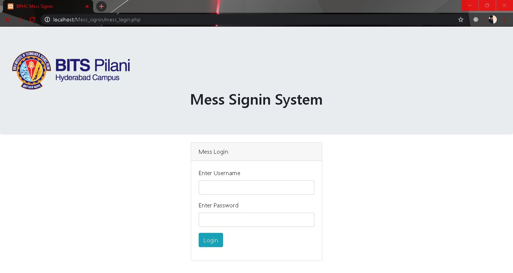
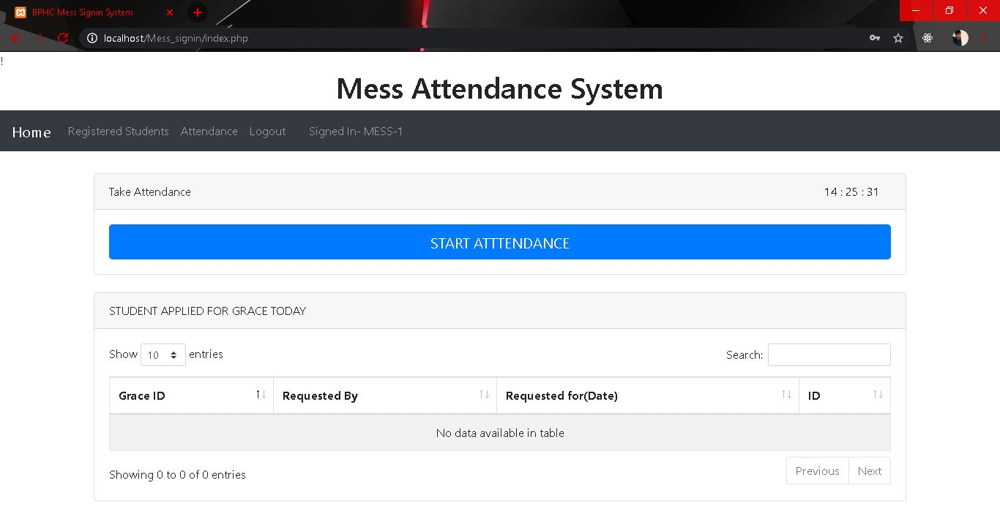
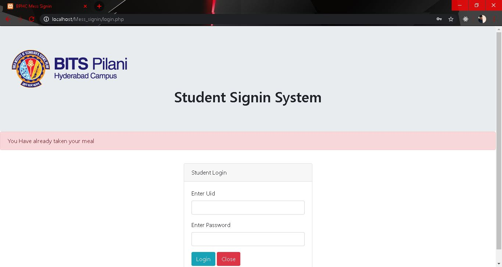
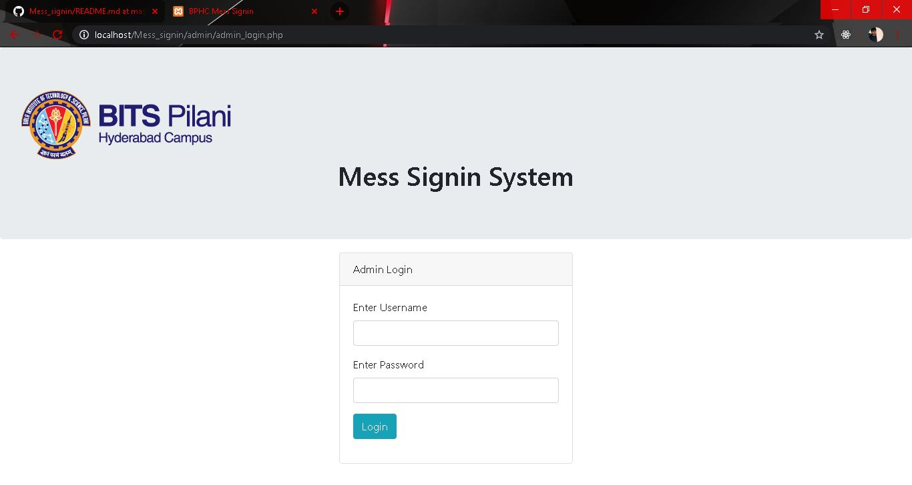
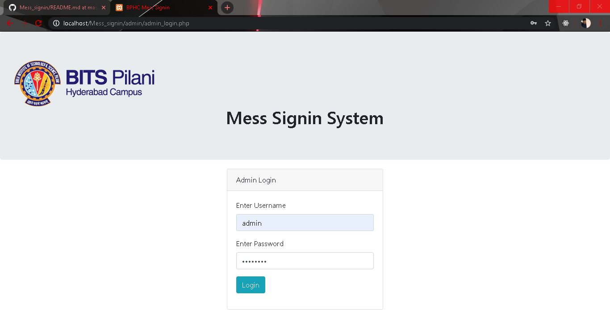
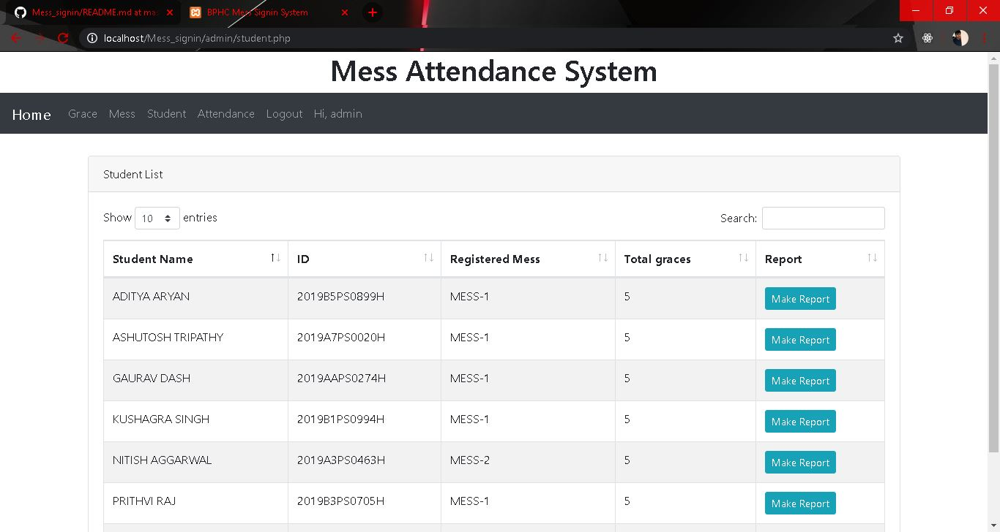
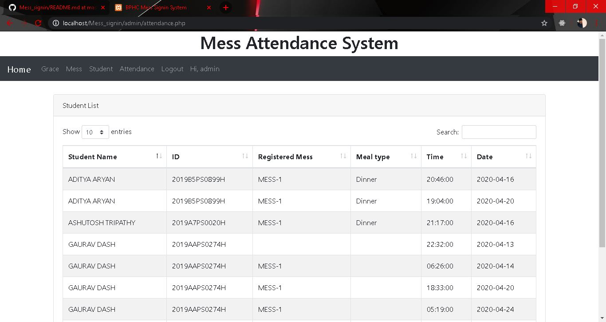

# Mess_signin

The Mess_signin system consists of 3 modules:-
1.admin module(In admin folder)
2.Mess Module
3.Student login system
The student login system is present in the attendance tab of mess module.One has to import data fro mysql folder and save it with the name "mess_signin".
The login credentials are provided in the database without any encryption. You can login from there.
Admin username- admin
Admin password- password
mess-1:username-mess1 , password-mess1
mess-2:username-mess2 , password-mess2
student attendance username- f20******
student attendance password- MESS-1 or MESS-2(Depending upon the registered mess).
**HERE ARE CERTAIN SCREENSHOTS TO THE PROJECT**
**MESS Login**

**ADMIN Login**

